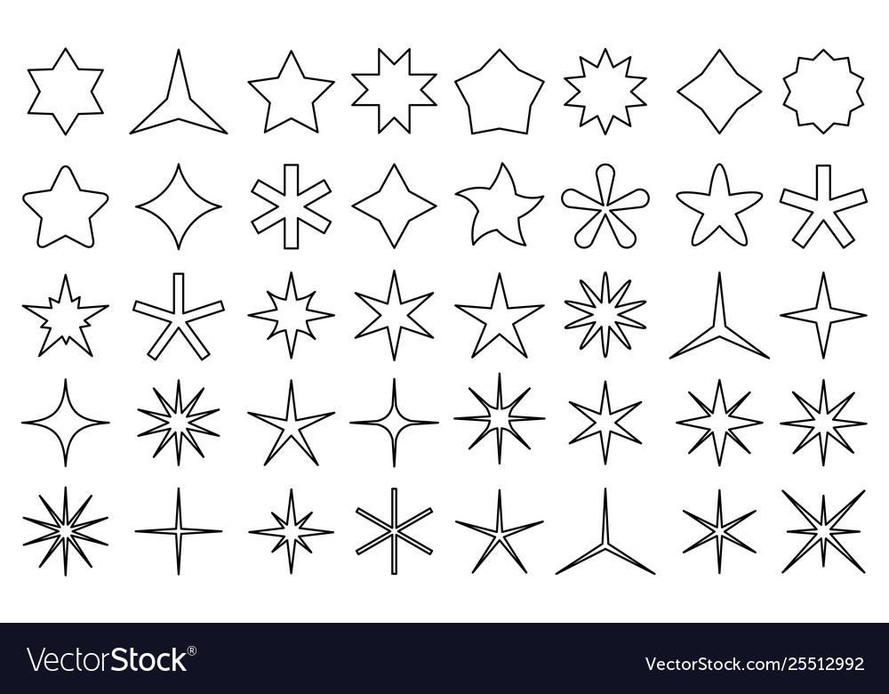

# Lab 01 - Hello World, Three.JS

## Antes de começar...

Lembre-se de que:

1. É necessário ter o diretório *Assets* posicionado corretamente;
2. É necessário ter um *web-server* ativo na sua máquina apontando para o diretório onde estarão localizados os códigos fonte.

Reveja os procedimentos de instalação no **Lab00** em caso de dúvida.

## Objetivos:

1. Compreender a estrutura básica de integração *html/javascript/Three.JS*;
2. Entender as formas básicas de interação de uma aplicação gráfica em Three.JS: eventos javascript ou GUI;
3. Utilizar primitivas gráficas simples e pré-codificadas bem como controlar seus atributos.

## Exercícios:

Nesse Lab apresentamos diversos exemplos de código mostrando algumas das estruturas básicas para programação utilizando o *framework* ***Three.JS***. 

Com base nesses códigos, faça o que se pede:

1. Modifique o exemplo "*Animação*" para que a mudança de cores ocorra de uma forma mais suave ao passar de uma cor para a outra. 

2. Pesquise na documentação do *Three.JS* que outros tipos de primitiva *line* podem ser criadas. Modifique o exemplo "*primitivas2D*" para testar essas outras formas de linha. 

3. Procure quais mecanismos o *Three.JS* oferece para controlar a aparência das linhas desenhas pelo *Three.JS*. Faça uma nova modificação no exemplo "*primitivas2D*" para a mudança de aparência de linhas. 

4. Outras formas de objetos 3D são disponibilizadas pelo *Three.JS*. Verifique que outras primitivas são essas e inclua algumas delas que voce achar mais interessante no exemplo "*Primitivas3D*" .

5. Assim como as linhas, objetos 3D também podem ter sua aparência customizada. Pesquise algumas possbilidades de mudança na aparência, incorporando esses parametros na GUI. Dessa forma, qualquer que seja o objeto, sua aparência deve ser aquela que segue as especificações da GUI naquele momento. 

6. Agora que sabemos desenhar linhas, várias formas podem ser feita apenas com elas, como por exemplo estrelas. Na figura abaixo há várias sugestões de formatos de estrelas. Escolha 3 que voce acha mais interessantes e construa suas formas utilizando as primitivas baseadas em linhas do *Three.JS*. Perceba que por se tratarem de figuras geométricas que apresentam regularidades e simetrias, é possível utilizar algoritmos para criar essas formas. Leve isso em conta na sua solução.

Dúvidas? Poste no *Discord* da disciplina, no canal de **dúvidas-prática**.

## Referências:

- https://threejs.org/docs/index.html

- https://www.npmjs.com/package/lil-gui

- Dirksen, J., **Learn Three.JS: Program 3D animations and visualizations for the web with JavaScript and WebGL**. 4th Edition, Packt Publishing, 2023.

