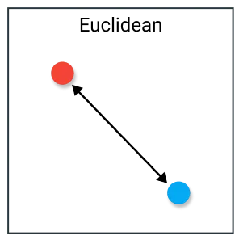
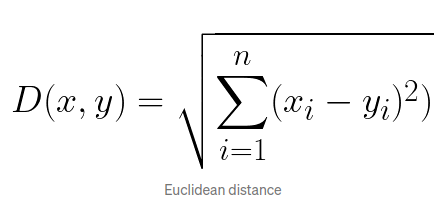
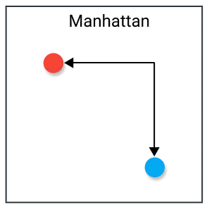
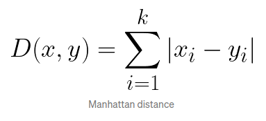
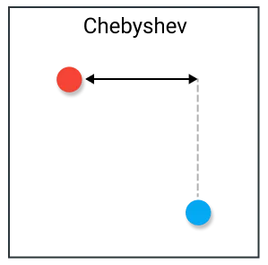
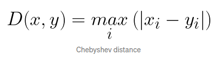

# Lab 02 - *Shaders* em *Three.js*

## Objetivos:

1. Compreender o que é um shader e seu papel dentro do *pipeline* gráfico;
2. Entender como se dá a integração de um *shader* dentro de uma aplicação gráfica em Three.JS;
3. Perceber as diferenças entre *vertex shader* e *fragment shader*, seus propõsitos e parâmetros. 

## Exercícios:

 1. Modifique o exemplo *Vertex Shader* para ter mais controles na definição do terreno, como sua fase e seu fator de escala;
 2. O exemplo *fragment shader* determina a cor dos pixels da imagem a partir da analise da sua distancia ao centro da tela. A métrica de distância usada foi a Euclidiana:

Experimente substituir por outras métricas de distancia como:

Inclua na GUI do exemplo a seleção da métrica a ser usada pelo *shader*.

3. O padrão de cores utilizado no exemplo anterior apenas destaca pixels dentro e fora do limite definido pela variável raio. Pense em outros padrões de cores que possam gerar visualizações interessantes. Por exemplo, uma transĩção mais suave entre os tons, outras faixas de transição de valores, faixas variantes no tempo (gerando um padrão de animação). 

Dúvidas? Poste no *Discord* da disciplina, no canal de **dúvidas-prática**.

## Referências:

- https://threejs.org/docs/index.html?q=shader#api/en/materials/ShaderMaterial

- https://threejs.org/manual/?q=shader#en/shadertoy

- https://webglfundamentals.org/webgl/lessons/webgl-shaders-and-glsl.html

- https://registry.khronos.org/OpenGL-Refpages/gl4/