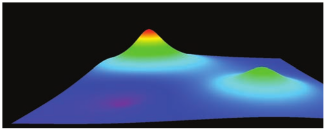
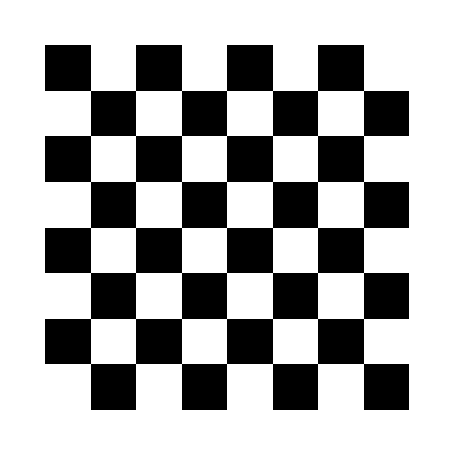
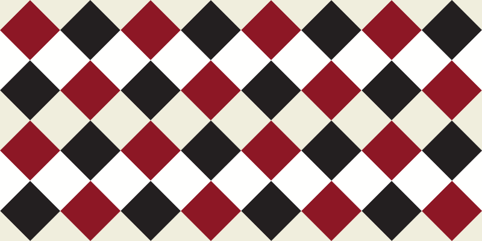

# Lab 02 - *Shaders* em *Three.js*

## Atividades Extras:

 1. Com base no exemplo do terreno do Lab02 (*vertex shader*), faça o que se pede:

   1. Crie um terreno mais denso, ou seja, com mais amostras (vértices);
   1. Defina a cor de cada vértice com base na altura do terreno, como um mapa de relevo de um atlas (como na Figura 1);
   1. Modifique a função de geração do terreno definida no *shader* para que gere outro tipo de terreno menos regular.

Figura 1.

2. Usando como base o exemplo do desenho do circulo (*fragment shader*), faça o que se pede:

   1. Produza um padrão de quadriculado preto e branco (tabuleiro de xadrez) cujo tamanho de cada quadrado seja definido pelo usuário atraves da interface gráfica (tal qual o raio do circulo);
   1. Produza um padrão de losangos coloridos como os da Figura 3. 

Figura 2.

Figura 3.

Duvidas devem ser encaminhadas no *Discord* da disciplina, no canal de **dúvidas-prática**.

> Atenção a data de entrega!!

## Referências:

	https://threejs.org/docs/index.html?q=shader#api/en/materials/ShaderMaterial

	https://threejs.org/manual/?q=shader#en/shadertoy

	https://webglfundamentals.org/webgl/lessons/webgl-shaders-and-glsl.html

	https://registry.khronos.org/OpenGL-Refpages/gl4/
