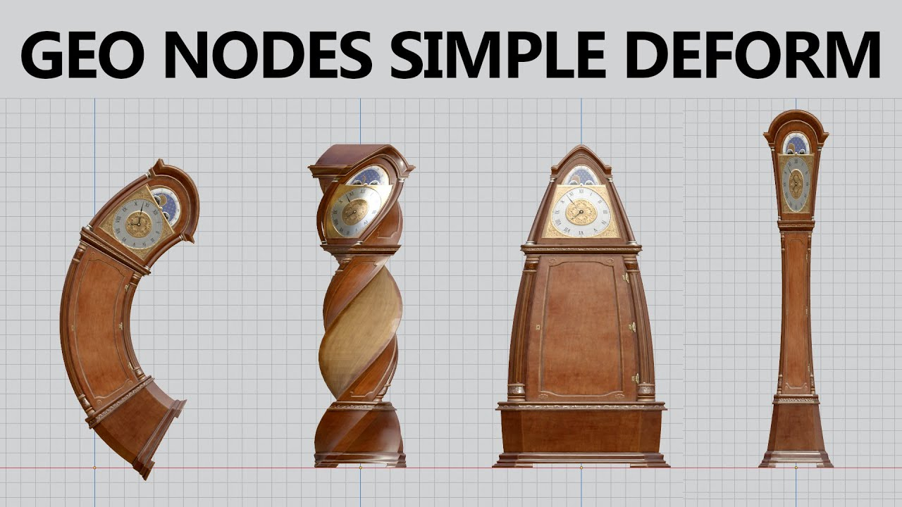

# Lab05a - Transformações Geométricas e Sistema de Visualização (complemento)

## Objetivos:

1. Apronfundar os conceitos de transformações Geométricas, sua representação matricial homogenea e seu papel dentro do *pipeline* gráfico;
2. Aplicar transformações geométricas para a geração de animações simples;
3. Reforçar os conceitos envolvidos no processo de formação de imagens de uma camera virtual;
4. Usar os parâmetros de controle de uma camera virtual para produzir animações simples.  

## Exercícios Complementares:

Após analisar com cuidado os códigos fornecidos nesse Lab e faça o que se pede:

1. Modifique o exercicío **3** do **Lab05** para que implemente a transformação de *twist*, ou seja, torcer um objeto ao longo de um de seus eixos, como na Figura 1 no centro;
2. Modifique o exercicío anterior para que implementar também a transformação de *bending*, ou seja, dobrar um objeto em uma dada direção, como na Figura 1 à esquerda;
3. Acrescente mais uma transformação ao exercicío anterior: *tapering*, ou seja, afunila ou dilata partes de um objeto, como na Figura 1 à direita;

Figura 1 - Transformações de *Bending*, *Twist* e *Tapering*.

4. Modifique o exercicío **4** do **Lab05** para que as 4 cameras possam ser vistas simultaneamente no mesmo *canvas*2. 
5. Crie uma animação que permita ver o movimento dos planetas, criado no exercício **1** do **Lab05**, por uma camera externa que avance pelo espaço 3D acompanhando o movimento do sistema solar, como na Figura 2.  

Figura 2 - Movimento do Sistema Solar em 3D.

## Referências:

- Barr, Alan H.. **Global and local deformations of solid primitives.** Proceedings of the 11th annual conference on Computer graphics and interactive techniques (1984). Disponível em: https://www.cs.drexel.edu/~david/Classes/CS586/Papers/p21-barr.pdf 

- MARSCHNER, Steve; SHIRLEY, Peter. "**Fundamentals of Computer Graphics**". 5th Edition CRC Press, 2021.

- Dirksen, J., **Learn Three.JS: Program 3D animations and visualizations for the web with JavaScript and WebGL**. 4th Edition, Packt Publishing, 2023.

- https://threejs.org/docs/index.html

- https://www.npmjs.com/package/lil-gui

