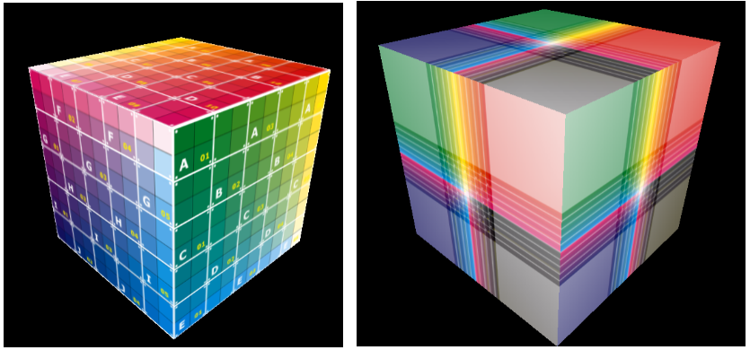
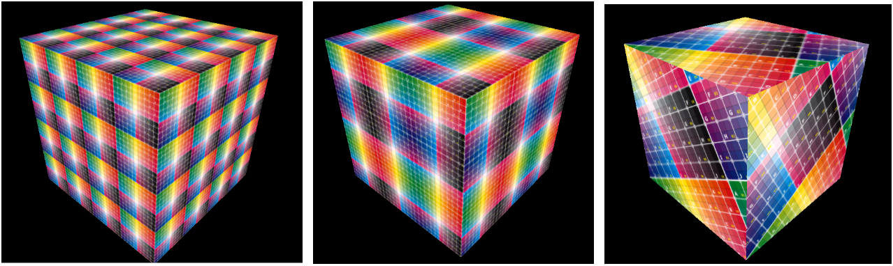

# Lab08 - Mapeamento de Texturas

## Objetivos:

1. Entender melhor como aplicar texturas nos objetos de uma cena do *Three.JS*
2. Aprofundar os conceitos relacionados aos parâmetros relativos a texturas e seus efeitos visuais em modelos simples. 

## Exercícios:

Com base nos códigos fonte fornecidos faça o que se pede:

1. Modifique o arquivo do modelo do cubo utilizado no exemplo "Coordenadas de Textura", para que ele possa ser visualizado como nas figuras abaixo. Considere que as faces opostas possuem o mesmo padrão de textura.

 

2. Modifique o código utilizado no exemplo "Coordenadas de Textura" para que os padrões das figuras abaixo sejam gerados. Atenção, pois dessa vez as coordenadas de textura do modelo original não devem ser alteradas!

 

3. No exemplo dos modelos de planetas, o modelo de urano não apresenta seus aneis. Além disso, o planeta urano possui uma rotação e uma orientação de seus aneis peculiar, como mostra a figura abaixo. Faça os ajustes para que esse modelo apareça corretamente. 

 

4. Modifique o exemplo do atlas de textura para que apresente os demais modelos que possuem esse tipo de textura, localizados no repositório Assets da disciplina. 

## Referências:

[1] MARSCHNER, Steve; SHIRLEY, Peter. "**Fundamentals of Computer Graphics**". 5th Edition CRC Press, 2021.

[2] Dirksen, J., **Learn Three.JS: Program 3D animations and visualizations for the web with JavaScript and WebGL**. 4th Edition, Packt Publishing, 2023.

[3] https://threejs.org/docs/index.html

[4] https://threejs.org/docs/index.html?q=texture#api/en/loaders/TextureLoader

[5] https://threejs.org/docs/index.html?q=texture#api/en/loaders/CubeTextureLoader