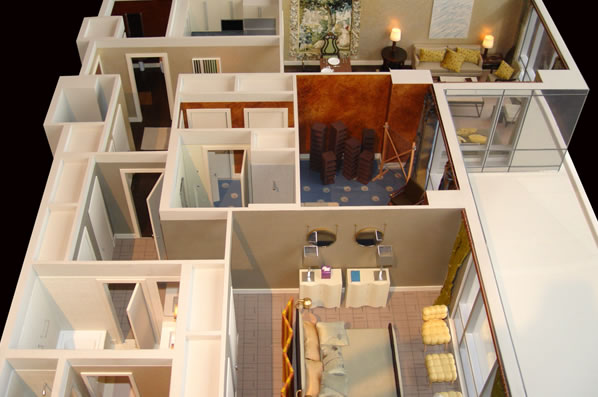
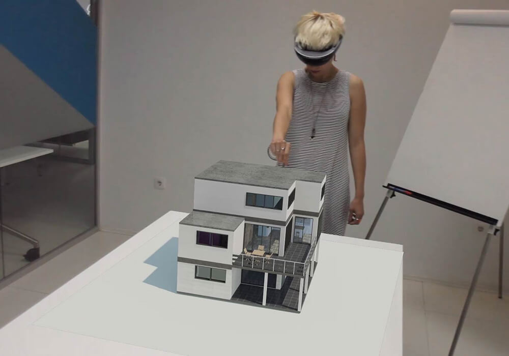
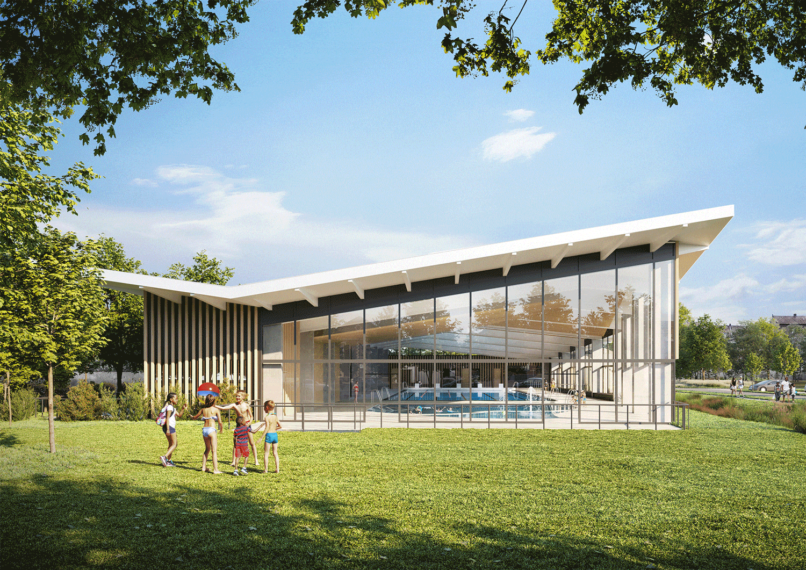
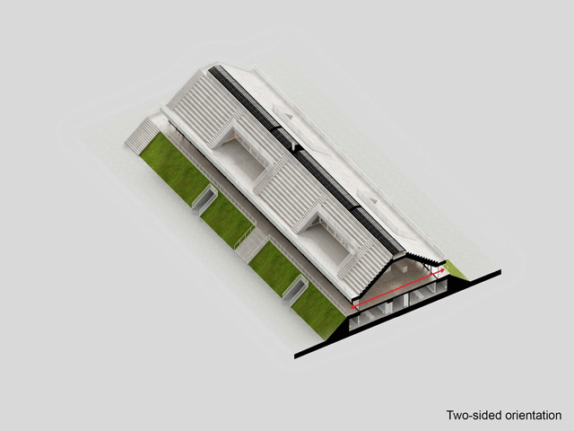

# Atividade 1 - Visitando uma Maquete Virtual

## Contexto

O uso de modelos virtuais em Arquitetura, Urbanismo e Engenharia é uma realidade desde o inicio dos anos 2000. Hoje, com a facilidade que ambientes virtuais iterativos podem ser produzidos e modificados em motores de jogos esses modelos virtuais ganharam uma nova dimensão: a imersão. Aplicações que se utilizam de Realidade Virtual ou Aumentada já não são mais restritas a ambientes de pesquisa. Na Figura 1 podemos ver a visão de uma Maquete Virtual tradicional e suas versões iterativas utilizando Realidade Aumentada e Realidade Virtual. 

*Figura 1 - Maquetes Virtuais estáticas (acima) estão sendo hoje substituidas por Maquetes Virtais Iterativas atraves de ferramentas como Realidada Aumentada (centro) e Realidade Virtual (abaixo).*

## O Problema:

O objetivo da atividade é construir uma aplicação em [Three.JS](https://threejs.org/) que permita simular um passeio por uma **Maquete Virtual**. A maquete a ser utilizada deve ser um modelo de arquitetura (casa, edifício, museu, shopping, etc) a sua escolha [^1]. 

É Para tanto voces devem fornecer ao usuário 3 modalidades de percurso:

1. **Modo Visita Interna**: O usuário poderá andar pela maquete, visitando seu interior, como uma pessoa o faria em um modelo real [^2];

2. **Modo Visita Externa**: Nesse modo o usuário pode "voar como um drone" no lado externo da maquete virtual;

3. **Modo Visita Guiada**: Defina pelo menos 3 pontos de interesse na maquete onde o usuário é "transportado" para o local e pode apenas observar o ambiente ver ao seu redor, sem se deslocar pelo ambiente.

Voce pode utiliziar qualquer um dos [*controlers*](https://threejs.org/docs/index.html?q=control) disponíveis no *Three.JS*. No entanto, esses *controlers* devem ser customizados, de tal forma que permitam a real sensação de cada tipo de visita. Em outras palavras, questões como escala, velocidade do movimento e tipo de controle disponível devem ser levadas em conta. 

Para que o usuário tenha uma sensação de escala, arquitetos geralmente colocam modelos humanos em suas maquetes, como mostra a Figura 2. Coloque na sua maquete virtual pelo menos 2 avatares articulados e animados [^3], um na parte interna e outro na parte externa, que podem ser encontrados durante a visita do usuário aos espaços da maquete virtual.  

*Figura 2 - A presença de figuras humanas em maquetes permite ao observador ter uma noção mais precisa da escala dos espaços.*

Por fim, um recurso bastante interessante de visualização de maquetes virtuais são os cortes, como mostra a Figura 3. Através deles podemos observar detalhes internos presentes na maquete de um ponto de vista mais global que entrar em seu interior. Dependendo do plano utilizado, aspectos diferentes da construção podem ser revelados. 

*Figura 3 - Exemplos do uso de planos de corte para mostrar detalhes internos de maquetes.*

Sua aplicação deve, no modelo de visitação externa, prover 3 planos de corte, referentes a cada direção cartesiana, permitindo que durante a visitação externa os detalhes internos da construção possam ser visualizados. 

## Requisitos:

- Considere a questão da escala ao configurar o movimento nas visitas.
- Nos modos de **Visita Interna** e **Externa** algum tipo de restrição de movimento que o impeça de sair do seu espaço de visita. A restrição não precisa ser "precisa", mas deve ser capaz de impedir de forma "plausível" e talvez até "conservadora", que o usuário deixe seu espaço de visita. 
- Escreva um pequeno relatório técnico descrevendo o que foi feito e como. Atualize o arquivo READMME do seu repositório para isso. 

## Entrega e Critérios de Avaliação:

O trabalho será submetido individualmente através do repositório disponibilizado pelo professor, via *GitHub Classroom*, para essa atividade. 

> **Não serão consideradas versões enviadas por e-mail, Google Classroom, Discord, ou outros meios.**

O trabalho será avaliado a partir dos seguintes critérios:

| Critério | Pontuação |
| :--- | :---: |
| 1. Relatório (README) | 0,5 |
| 2. Configuração do cenário (modelo+avatares) | 1,0 | 
| 3. Modo Visita Interna | 2,0 |
| 4. Modo Visita Externa | 2,0 |
| 5. Modo Visita Guiada | 2,0 |
| 6. Confinamento dos movimentos ao modelo | 1,0 |
| 7. Visibilidade dos planos de corte | 1,5 |

## Penalidades:              

> Será aplicada a penalização de -1,0 pto por dia de atraso (verificado via data da ultima submissão no repositório)
> 
>> **Em casos de plágio (total ou parcial) todos os envolvidos terão suas avaliações zeradas**. 

## Referências:

[1] Peter SHIRLEY, Michael ASHIKHMIN, Steve MARSCHNER. **Fundamentals of Computer Graphics**. AK Peters/CRC Press, 5th Edition, 2021.

[2] John F. Hughes, Andries van Dam, Morgan McGuire, David F. Sklar, James D. Foley, Steven K. Feiner. **Computer Graphics : Principles and Practice Third Edition in C**. Addison-Weslley. 2013.

[3] Dirksen, J., **Learn Three.JS: Program 3D animations and visualizations for the web with JavaScript and WebGL**. 4th Edition, Packt Publishing, 2023.

[4] *SketchFab*. Disponível em: https://sketchfab.com/.

[^1]: Procure por modelos no formato glTF em sites especializados como [4].
[^2]: A colisão entre os elementos do espaço, como móveis, portas e paredes podem ser desconsideradas nesse caso. 
[^3]: Utilize os modelos animados dos exemplos do [*Three.JS*](https://threejs.org/examples/?q=animation#webgl_animation_skinning_additive_blending) ou se quiser busque em sites especializados [4] modelos mais interessantes para o seu contexto.
